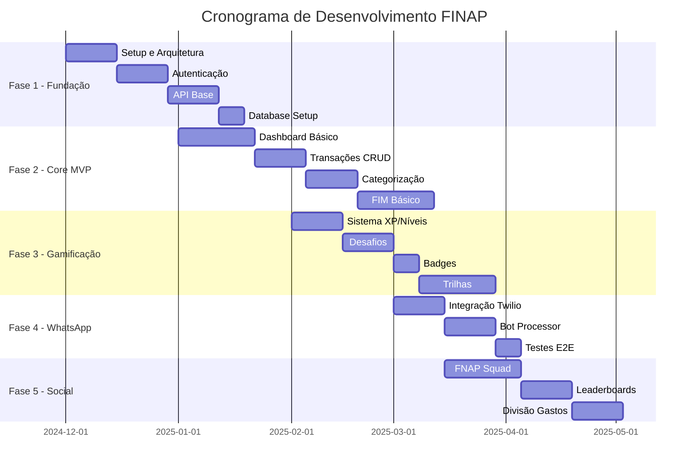
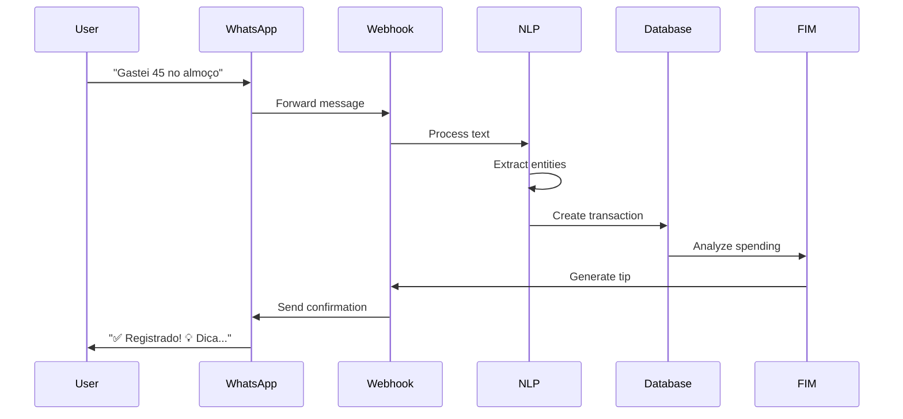

# 🚀 Plano de Fases - FINAP

## 📊 Visão Geral do Cronograma



## 📋 Fase 1: Fundação e Infraestrutura
**Duração:** 4 semanas  
**Início:** 01/12/2024  
**Término:** 28/12/2024

### Objetivos
- Estabelecer arquitetura base do sistema
- Configurar ambiente de desenvolvimento
- Implementar autenticação e autorização
- Setup de CI/CD pipeline

### Entregáveis

#### Semana 1-2: Setup Inicial
- [x] Repositório Git com estrutura de pastas
- [x] Docker compose para desenvolvimento local
- [x] Configuração Firebase (Firestore + Auth)
- [x] Setup Google Cloud Project
- [x] Documentação de ambiente

#### Semana 3: Backend Foundation
```python
# Estrutura Backend
backend/
├── main.py
├── core/
│   ├── config.py
│   ├── security.py
│   └── database.py
├── api/
│   ├── auth/
│   │   ├── router.py
│   │   └── dependencies.py
│   └── health/
└── tests/
```

**APIs Implementadas:**
- `POST /api/v1/auth/register`
- `POST /api/v1/auth/login`
- `POST /api/v1/auth/refresh`
- `GET /api/v1/health`

#### Semana 4: Frontend Foundation
```javascript
// Estrutura Frontend
frontend/
├── App.tsx
├── src/
│   ├── screens/
│   │   ├── Auth/
│   │   └── Onboarding/
│   ├── navigation/
│   ├── services/
│   ├── store/
│   └── components/
```

**Telas Implementadas:**
- Splash Screen
- Login/Register
- Onboarding Flow (3 steps)

### Critérios de Sucesso
- ✅ Usuário consegue se registrar e fazer login
- ✅ Tokens JWT funcionando
- ✅ CI/CD pipeline rodando
- ✅ Testes unitários passando (>80% coverage)

### Recursos Necessários
- 1 Backend Developer Senior
- 1 Mobile Developer
- 1 DevOps Engineer

---

## 🏗️ Fase 2: Core MVP
**Duração:** 6 semanas  
**Início:** 01/01/2025  
**Término:** 14/02/2025

### Objetivos
- Implementar funcionalidades essenciais de gestão financeira
- Dashboard funcional com dados reais
- Chat básico com FIM
- Sistema de categorias

### Entregáveis

#### Semana 1-2: Dashboard e Overview
**Backend:**
```python
# Endpoints
GET  /api/v1/users/profile
GET  /api/v1/users/statistics
GET  /api/v1/dashboard/summary
```

**Frontend:**
- Tela Home com cards de resumo
- Gráfico de pizza básico
- Navegação bottom tab

#### Semana 3-4: Gestão de Transações
**Backend:**
```python
# CRUD Transações
POST   /api/v1/transactions
GET    /api/v1/transactions
PUT    /api/v1/transactions/{id}
DELETE /api/v1/transactions/{id}
GET    /api/v1/transactions/categories
```

**Frontend:**
- Tela de adicionar transação
- Lista de transações com filtros
- Categorização manual
- Edição/exclusão de transações

#### Semana 5-6: FIM Assistant v1
**Backend:**
```python
# Integração Gemini
POST /api/v1/fim/chat
GET  /api/v1/fim/suggestions

# Prompts básicos
- Responder dúvidas financeiras
- Dar dicas baseadas em gastos
- Sugerir economias
```

**Frontend:**
- Tela de chat com FIM
- Bubbles de mensagem
- Sugestões rápidas
- Histórico básico

### Features MVP

| Feature | Prioridade | Status | Complexidade |
|---------|------------|--------|--------------|
| Registro de gastos | P0 | 🔄 | Média |
| Categorias fixas | P0 | 🔄 | Baixa |
| Dashboard simples | P0 | 🔄 | Média |
| Chat FIM básico | P0 | 🔄 | Alta |
| Filtros de período | P1 | ⏳ | Média |
| Gráficos básicos | P1 | ⏳ | Média |
| Exportar dados | P2 | ⏳ | Baixa |

### Critérios de Sucesso
- ✅ Usuário consegue registrar e visualizar gastos
- ✅ FIM responde perguntas básicas
- ✅ Dashboard mostra resumo financeiro
- ✅ App estável sem crashes críticos

### Recursos Necessários
- 2 Backend Developers
- 2 Mobile Developers
- 1 QA Tester

---

## 🎮 Fase 3: Sistema de Gamificação
**Duração:** 5 semanas  
**Início:** 15/02/2025  
**Término:** 21/03/2025

### Objetivos
- Implementar sistema completo de gamificação
- Adicionar elementos de engajamento
- Criar trilhas de aprendizado
- Sistema de recompensas

### Entregáveis

#### Semana 1: Sistema Base de XP e Níveis
**Backend:**
```python
# Gamification Engine
class GamificationService:
    - calculate_xp()
    - check_level_up()
    - award_badges()
    - track_streak()

# Endpoints
GET  /api/v1/gamification/status
POST /api/v1/gamification/action
```

**Regras de XP:**
| Ação | XP | Cooldown |
|------|-----|----------|
| Login diário | 10 | 24h |
| Registrar gasto | 5 | - |
| Completar desafio | 50 | - |
| Streak 7 dias | 100 | 7d |
| Quiz correto | 20 | - |

#### Semana 2: Desafios e Missões
**Tipos de Desafios:**
```javascript
// Challenge Types
interface Challenge {
  id: string;
  type: 'daily' | 'weekly' | 'monthly';
  category: 'saving' | 'tracking' | 'learning';
  requirement: {
    metric: string;
    target: number;
    current: number;
  };
  rewards: {
    xp: number;
    coins: number;
    badge?: string;
  };
}
```

**Frontend:**
- Tela de desafios ativos
- Cards de progresso
- Animações de conclusão

#### Semana 3: Sistema de Badges e Conquistas
**Badges Iniciais:**
| Badge | Requisito | Raridade |
|-------|-----------|----------|
| 🎯 Primeira Meta | Completar 1 desafio | Comum |
| 💰 Poupador | Economizar R$ 100 | Comum |
| 📚 Estudioso | Completar 5 quizzes | Incomum |
| 🔥 Em Chamas | Streak de 30 dias | Raro |
| 👑 Mestre Financeiro | Nível 50 | Épico |

#### Semana 4-5: Trilhas de Conhecimento
**Módulos Iniciais:**
1. **Finanças Básicas**
   - O que é orçamento?
   - Receitas vs Despesas
   - Quiz: 5 questões

2. **Poupança**
   - Por que poupar?
   - Regra 50-30-20
   - Quiz: 5 questões

3. **Cartão de Crédito**
   - Como funciona?
   - Juros e taxas
   - Quiz: 5 questões

**Sistema de Vidas:**
```javascript
// Lives System
const INITIAL_LIVES = 5;
const RECHARGE_TIME = 5 * 60 * 60 * 1000; // 5 hours
const LIFE_COST = {
  quiz_retry: 1,
  skip_challenge: 2,
  unlock_content: 1
};
```

### Métricas de Gamificação

```typescript
interface GamificationMetrics {
  engagement: {
    dailyActiveUsers: number;
    avgSessionTime: number;
    challengeCompletionRate: number;
  };
  progression: {
    avgUserLevel: number;
    totalXPAwarded: number;
    badgesUnlocked: number;
  };
  monetization: {
    coinsSpent: number;
    livePurchased: number;
  };
}
```

### Critérios de Sucesso
- ✅ Sistema de XP/níveis funcionando
- ✅ Mínimo 10 desafios diferentes ativos
- ✅ 15+ badges implementados
- ✅ 3 trilhas completas com quiz
- ✅ Aumento de 30% em retenção D7

### Recursos Necessários
- 1 Game Designer
- 2 Backend Developers
- 2 Mobile Developers
- 1 UI/UX Designer

---

## 📱 Fase 4: Integração WhatsApp
**Duração:** 4 semanas  
**Início:** 22/03/2025  
**Término:** 18/04/2025

### Objetivos
- Integração completa com WhatsApp via Twilio
- Processamento inteligente de mensagens
- Comandos e respostas automatizadas
- Sincronização em tempo real

### Entregáveis

#### Semana 1: Setup Twilio e Webhook
**Backend:**
```python
# Twilio Integration
from twilio.rest import Client

class WhatsAppService:
    def __init__(self):
        self.client = Client(account_sid, auth_token)
    
    def send_message(self, to, body, media_url=None):
        return self.client.messages.create(
            from_='whatsapp:+14155238886',
            to=f'whatsapp:{to}',
            body=body,
            media_url=media_url
        )
    
    def process_incoming(self, message):
        # NLP processing
        # Extract: amount, category, description
        # Create transaction
        # Send confirmation
```

**Webhook Endpoint:**
```python
@app.post("/api/v1/whatsapp/webhook")
async def whatsapp_webhook(request: Request):
    # Verify Twilio signature
    # Parse message
    # Process command
    # Send response
```

#### Semana 2: Processamento de Comandos
**Comandos Suportados:**
| Comando | Exemplo | Ação |
|---------|---------|------|
| Registrar gasto | "Gastei 50 no mercado" | Cria transação |
| Ver saldo | "Saldo" | Retorna resumo |
| Últimos gastos | "Extrato" | Lista 5 últimas |
| Ajuda | "Ajuda" ou "?" | Menu de comandos |
| Categorias | "Categorias" | Lista categorias |
| Meta | "Meta 500" | Define meta mensal |

**NLP Pipeline:**
```python
# Message Processing Pipeline
1. Language Detection (PT-BR)
2. Intent Classification
3. Entity Extraction (valor, categoria)
4. Validation
5. Action Execution
6. Response Generation
```

#### Semana 3: Respostas Inteligentes
**Templates de Resposta:**
```python
responses = {
    "transaction_created": """
    ✅ Gasto registrado!
    💰 Valor: R$ {amount}
    📁 Categoria: {category}
    💳 Saldo atual: R$ {balance}
    
    {tip}
    """,
    
    "daily_summary": """
    📊 Resumo do dia {date}
    ➕ Receitas: R$ {income}
    ➖ Despesas: R$ {expenses}
    💰 Saldo: R$ {balance}
    
    Maiores gastos:
    {top_expenses}
    """,
    
    "alert": """
    ⚠️ Atenção!
    {message}
    
    💡 Dica: {tip}
    """
}
```

#### Semana 4: Notificações Proativas
**Tipos de Notificações:**
| Tipo | Frequência | Conteúdo |
|------|------------|----------|
| Resumo diário | 20h | Gastos do dia |
| Alerta de meta | Quando atingir 80% | Aviso de proximidade |
| Dica semanal | Segundas 9h | Dica personalizada |
| Lembrete | Configurável | Registrar gastos |

### Fluxo WhatsApp Completo



### Critérios de Sucesso
- ✅ 95% de mensagens processadas corretamente
- ✅ Tempo de resposta < 3 segundos
- ✅ Suporte a 10+ comandos diferentes
- ✅ Notificações automáticas funcionando
- ✅ 50% dos usuários usando WhatsApp

### Recursos Necessários
- 1 Backend Developer (NLP)
- 1 Backend Developer (Integration)
- 1 QA Tester
- Créditos Twilio: $200/mês

---

## 👥 Fase 5: Features Sociais
**Duração:** 6 semanas  
**Início:** 19/04/2025  
**Término:** 30/05/2025

### Objetivos
- Implementar FNAP Squad
- Sistema de rankings e leaderboards
- Divisão de gastos colaborativa
- Desafios em grupo

### Entregáveis

#### Semana 1-2: FNAP Squad Core
**Backend:**
```python
# Squad Management
POST   /api/v1/squads                 # Criar squad
POST   /api/v1/squads/{id}/join       # Entrar
POST   /api/v1/squads/{id}/leave      # Sair
GET    /api/v1/squads/{id}/members    # Listar membros
POST   /api/v1/squads/{id}/goals      # Criar meta
```

**Squad Features:**
- Máximo 10 membros
- Metas compartilhadas
- Chat interno
- Progresso coletivo

#### Semana 3: Divisão de Gastos
**Funcionalidades:**
```typescript
interface SharedExpense {
  id: string;
  squadId: string;
  description: string;
  totalAmount: number;
  paidBy: string;
  splits: Split[];
  status: 'pending' | 'partial' | 'settled';
  createdAt: Date;
}

interface Split {
  userId: string;
  amount: number;
  paid: boolean;
  paidAt?: Date;
}
```

**Algoritmos de Divisão:**
- Igual para todos
- Valores customizados
- Percentual
- Por itens consumidos

#### Semana 4: Leaderboards
**Tipos de Rankings:**
| Ranking | Métrica | Atualização |
|---------|---------|-------------|
| XP Total | Total de XP | Real-time |
| Economia | Maior % economizado | Diária |
| Streaks | Dias consecutivos | Diária |
| Desafios | Desafios completos | Semanal |
| Squad | XP médio do grupo | Real-time |

**Frontend:**
- Tela de rankings global
- Rankings por categoria
- Rankings de amigos
- Animações de mudança de posição

#### Semana 5-6: Desafios em Grupo
**Tipos de Desafios Colaborativos:**
1. **Meta Coletiva**
   - Ex: "Economizem R$ 1000 juntos"
   - Recompensa dividida

2. **Competição**
   - Ex: "Quem economiza mais?"
   - Recompensa para top 3

3. **Cooperativo**
   - Ex: "Todos devem completar"
   - Recompensa se todos conseguirem

### Componente Social Completo

```typescript
interface SocialFeatures {
  squad: {
    create: boolean;
    join: boolean;
    maxMembers: number;
    sharedGoals: boolean;
  };
  
  expenses: {
    splitBills: boolean;
    trackDebts: boolean;
    sendReminders: boolean;
    settlementMethods: string[];
  };
  
  competition: {
    leaderboards: boolean;
    weeklyTournaments: boolean;
    friendsOnly: boolean;
    prizes: Prize[];
  };
  
  social: {
    addFriends: boolean;
    shareAchievements: boolean;
    compareStats: boolean;
    messaging: boolean;
  };
}
```

### Critérios de Sucesso
- ✅ 30% dos usuários em squads
- ✅ 100+ squads ativos
- ✅ Divisão de gastos funcionando
- ✅ Leaderboards atualizando em real-time
- ✅ Aumento de 40% em engajamento

### Recursos Necessários
- 2 Backend Developers
- 2 Mobile Developers
- 1 UI/UX Designer
- 1 QA Tester

---

## 📈 Fase 6: Analytics e Otimização
**Duração:** 3 semanas  
**Início:** 01/06/2025  
**Término:** 21/06/2025

### Objetivos
- Implementar tracking completo
- Dashboard de métricas
- A/B testing framework
- Otimizações de performance

### Entregáveis

#### Semana 1: Analytics Implementation
**Eventos para Tracking:**
```javascript
// Core Events
track('user_signup', { method: 'email' });
track('transaction_added', { amount, category, source });
track('challenge_completed', { challengeId, xpEarned });
track('fim_interaction', { messageCount, topic });
track('squad_joined', { squadId, memberCount });

// Engagement Events
track('screen_view', { screenName, duration });
track('feature_used', { feature, context });
track('notification_opened', { type, cta });
```

**Ferramentas:**
- Google Analytics 4
- Mixpanel para comportamento
- Amplitude para product metrics

#### Semana 2: Performance Optimization
**Mobile Optimizations:**
- Code splitting por rota
- Lazy loading de imagens
- Cache de dados offline
- Redução de re-renders

**Backend Optimizations:**
- Query optimization
- Redis caching
- Connection pooling
- Rate limiting

#### Semana 3: A/B Testing
**Testes Planejados:**
| Teste | Variante A | Variante B | Métrica |
|-------|------------|------------|---------|
| Onboarding | 3 telas | 5 telas | Completion rate |
| Gamification | XP visível | XP oculto | Engagement |
| Notificações | 1x/dia | 2x/dia | Retention |

### Critérios de Sucesso
- ✅ 100% dos eventos críticos trackeados
- ✅ Dashboard de métricas funcionando
- ✅ App performance < 2s load time
- ✅ 3+ A/B tests rodando

---

## 🚀 Fase 7: Preparação para Launch
**Duração:** 4 semanas  
**Início:** 22/06/2025  
**Término:** 19/07/2025

### Objetivos
- Preparar infraestrutura para produção
- Testes finais e bug fixes
- Preparar materiais de marketing
- Soft launch

### Entregáveis

#### Semana 1: Production Setup
**Checklist DevOps:**
- [ ] SSL certificates
- [ ] CDN configuration
- [ ] Backup strategy
- [ ] Monitoring alerts
- [ ] Security audit
- [ ] Load testing
- [ ] Disaster recovery plan

#### Semana 2: Quality Assurance
**Testes Finais:**
- Regression testing
- Security testing
- Performance testing
- Accessibility testing
- Cross-device testing

#### Semana 3: Marketing Prep
**Materiais:**
- App Store assets
- Landing page
- Video demo
- Press kit
- Social media content

#### Semana 4: Soft Launch
**Estratégia:**
- 500 usuários beta
- Região limitada (1 cidade)
- Feedback intensivo
- Iterações rápidas

### Critérios de Sucesso
- ✅ 0 bugs críticos
- ✅ 99.9% uptime
- ✅ App store approval
- ✅ 500+ beta users
- ✅ NPS > 8

---

## 🎯 Fase 8: Growth e Escala
**Duração:** Ongoing  
**Início:** 20/07/2025

### Objetivos
- Crescimento sustentável de usuários
- Monetização
- Features avançadas
- Expansão geográfica

### Roadmap Pós-Launch

#### Q3 2025
- Launch nacional
- 10k usuários
- Premium features
- Open Banking v1

#### Q4 2025
- 50k usuários
- Marketplace de rewards
- Investimentos básicos
- Parcerias bancárias

#### Q1 2026
- 150k usuários
- Expansão LATAM
- AI avançada
- B2B offerings

### Métricas de Crescimento

```typescript
interface GrowthMetrics {
  acquisition: {
    monthlyNewUsers: number;
    cac: number; // Customer Acquisition Cost
    virality: number; // K-factor
  };
  
  activation: {
    onboardingCompletion: number;
    firstTransactionRate: number;
    timeToValue: number; // minutes
  };
  
  retention: {
    d1: number;
    d7: number;
    d30: number;
    churnRate: number;
  };
  
  revenue: {
    arpu: number; // Average Revenue Per User
    ltv: number; // Lifetime Value
    conversionRate: number;
  };
  
  engagement: {
    dau_mau: number; // Daily/Monthly Active Users
    sessionsPerUser: number;
    sessionDuration: number;
  };
}
```

---

## 📊 Resumo de Recursos e Timeline

### Timeline Consolidado

| Fase | Duração | Início | Término | Status |
|------|---------|--------|---------|--------|
| 1. Fundação | 4 sem | 01/12/24 | 28/12/24 | 🔄 |
| 2. Core MVP | 6 sem | 01/01/25 | 14/02/25 | ⏳ |
| 3. Gamificação | 5 sem | 15/02/25 | 21/03/25 | ⏳ |
| 4. WhatsApp | 4 sem | 22/03/25 | 18/04/25 | ⏳ |
| 5. Social | 6 sem | 19/04/25 | 30/05/25 | ⏳ |
| 6. Analytics | 3 sem | 01/06/25 | 21/06/25 | ⏳ |
| 7. Launch Prep | 4 sem | 22/06/25 | 19/07/25 | ⏳ |
| **TOTAL** | **32 sem** | | | |

### Recursos Humanos por Fase

| Fase | Backend | Frontend | DevOps | QA | Design | PM | Total |
|------|---------|----------|--------|----|---------|----|-------|
| 1 | 1 | 1 | 1 | 0 | 0 | 1 | 4 |
| 2 | 2 | 2 | 0 | 1 | 1 | 1 | 7 |
| 3 | 2 | 2 | 0 | 1 | 1 | 1 | 7 |
| 4 | 2 | 1 | 0 | 1 | 0 | 1 | 5 |
| 5 | 2 | 2 | 0 | 1 | 1 | 1 | 7 |
| 6 | 1 | 1 | 1 | 1 | 0 | 1 | 5 |
| 7 | 1 | 1 | 1 | 2 | 1 | 1 | 7 |

### Budget Estimado por Fase

| Fase | Desenvolvimento | Infraestrutura | Marketing | Total |
|------|----------------|----------------|-----------|-------|
| 1 | R$ 40k | R$ 2k | R$ 0 | R$ 42k |
| 2 | R$ 70k | R$ 3k | R$ 0 | R$ 73k |
| 3 | R$ 70k | R$ 4k | R$ 5k | R$ 79k |
| 4 | R$ 50k | R$ 5k | R$ 5k | R$ 60k |
| 5 | R$ 70k | R$ 6k | R$ 10k | R$ 86k |
| 6 | R$ 35k | R$ 6k | R$ 10k | R$ 51k |
| 7 | R$ 50k | R$ 8k | R$ 30k | R$ 88k |
| **TOTAL** | **R$ 385k** | **R$ 34k** | **R$ 60k** | **R$ 479k** |

---

## 🎯 Definição de "Done" por Fase

### Fase 1 - Done Criteria
- [ ] Código em produção
- [ ] Documentação completa
- [ ] Testes >80% coverage
- [ ] Code review aprovado
- [ ] Sem bugs críticos
- [ ] Performance benchmarks atingidos

### Fase 2-7 - Done Criteria
- [ ] Todas as features da fase implementadas
- [ ] Testes E2E passando
- [ ] Documentação atualizada
- [ ] Métricas implementadas
- [ ] Aprovação do Product Owner
- [ ] Deploy em staging validado

---

## 🚨 Riscos e Mitigações

### Matriz de Riscos

| Risco | Probabilidade | Impacto | Mitigação |
|-------|--------------|---------|-----------|
| Atraso no desenvolvimento | Média | Alto | Buffer de 20% no cronograma |
| Custos de API excedidos | Alta | Médio | Implementar cache agressivo |
| Baixa adoção inicial | Média | Alto | Beta testing extensivo |
| Problemas de escalabilidade | Baixa | Alto | Load testing desde MVP |
| Mudanças regulatórias | Baixa | Alto | Consultoria jurídica |

### Plano de Contingência

**Se atrasar Fase 2 (MVP):**
- Reduzir escopo da gamificação
- Postergar features sociais
- Focar em core features

**Se custos excederem:**
- Buscar investimento seed
- Implementar monetização antes
- Reduzir equipe temporariamente

---

## 📝 Notas Finais

Este plano de fases foi desenvolvido considerando:
- Metodologia ágil com sprints de 2 semanas
- Releases incrementais
- Feedback contínuo de usuários
- Flexibilidade para ajustes

### Próximos Passos Imediatos
1. ✅ Aprovação do plano de fases
2. ⏳ Formação da equipe inicial
3. ⏳ Setup do ambiente de desenvolvimento
4. ⏳ Kickoff meeting
5. ⏳ Sprint 0 - Setup e planejamento detalhado

### Contato
**Product Owner:** [Nome]  
**Tech Lead:** [Nome]  
**Project Manager:** [Nome]  

---

**Documento versão:** 1.0.0  
**Última atualização:** Novembro 2024  
**Status:** Em Revisão  
**Próxima revisão:** Dezembro 2024
